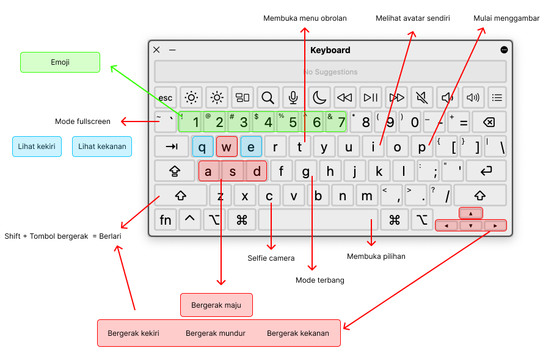

import Image from "@theme/IdealImage";

import HandSideIndex from "./img/hand_side_index.png";
import HandLeftFullAnalog from "./img/hand_left_full_analog.png";
import HandRightFullAnalog from "./img/hand_right_full_analog.png";

import HandFullMenu from "./img/hand_full_menu.png";

import HandSideSelect from "./img/hand_side_select.png";

import HandFullGrab from "./img/hand_full_grab.png";

import HandFullGrabRight from "./img/hand_full_grab_right.png";

import VideoWASD  from "./video/move.mp4"
import VideoTeleport  from "./video/teleport.mp4"
import VideoLookAround  from "./video/look_around.mp4"
import VideoSit  from "./video/sit.mp4"

import VideoMobile  from "./video/mobile.mp4"

Mengontrol penggunaan Aplikasi Dinus Metaverse dengan menggunakan berbagai device yaitu Laptop/PC, Smartphone, dan Oculus. Dari ketiga device tersebut masing-masing memiliki perbedaan yang akan menyuguhkan pengalaman berbeda di Dinus Metaverse.

### Laptop / PC

**- Bergerak**

<video autoPlay muted loop style={{ width:"100%",borderRadius:"16px" }}>
  <source src={VideoWASD}/>
</video>

Untuk bergerak klik tombol `W`-`A`-`S`-`D` pada keyboard, maka akan bergerak maju-kiri-mundur-kanan.

**- Teleport**

<video autoPlay muted loop style={{ width:"100%",borderRadius:"16px" }}>
  <source src={VideoTeleport}/>
</video>

Untuk melakukan teleportasi ke tempat yang dituju, arahkan mouse ke tempat yang ingin dituju kemudian klik kanan, tahan dan lepas.

**- Melihat sekitar**

<video autoPlay muted loop style={{ width:"100%",borderRadius:"16px" }}>
  <source src={VideoLookAround}/>
</video>

Untuk melihat sekitar klik dan tahan mouse pada layar lalu geser ke sudut yang ingin dilihat.

**- Duduk**

<video autoPlay muted loop style={{ width:"100%",borderRadius:"16px" }}>
  <source src={VideoSit}/>
</video>

Untuk duduk pada kursi yang tersedia di dalam ruangan, klik `spasi` pada keyboard dan tahan, kemudian arahkan ke kursi yang diinginkan, lalu klik pada icon diatas kursi.

### Smartphone

<video autoPlay muted loop style={{ width:"100%", maxWidth:"200px", borderRadius:"16px" }}>
  <source src={VideoMobile}/>
</video>

**- Bergerak**

Untuk bergerak lakukan Zoom in pada layar untuk bergerak maju, dan lakukan Zoom out pada layar untuk bergerak mundur.

**- Melihat sekitar**

Untuk melihat sekitar lakukan Swipe / usap layar ke sudut yang ingin di lihat.

### Headset VR (Oculus Quest 2)

**- Bergerak**

Untuk bergerak tekan 2-3 detik tombol yang terletak pada jari telunjuk di hand grip oculus kanan/kiri dengan menempatkan pada lantai/lokasi yang akan dituju, kemudian lepaskan, maka akan bergerak/berpindah/teleport.

<Image
  alt="Hand controller oculus index finger"
  img={HandSideIndex}
  style={{ maxWidth: "1000px" }}
/>

Bisa juga dengan menekan tombol analog pada hand grip oculus sebelah kanan, kemudian arahkan maju-mundur-kanan-kiri sesuai dengan lokasi yang akan dituju.

<Image
  alt="Hand controller oculus right analog"
  img={HandRightFullAnalog}
  style={{ maxWidth: "1000px" }}
/>

**- Melihat sekitar**

Selain secara langsung melihat sekitar karena oculus dapat melihat 360 derajat, untuk melihat sekitar/menghadap bisa juga dengan menekan tombol analog pada hand grip oculus sebelah kiri, kemudian dapat diarahkan ke kanan/kiri sesuai dengan keinginan.

<Image
  alt="Hand controller oculus left analog"
  img={HandLeftFullAnalog}
  style={{ maxWidth: "1000px" }}
/>

**- Memilih menu**

Untuk memilih menu dapat menekan tombol X pada hand grip oculus sebelah kiri dan menekan tombol A pada hand grip oculus sebelah kanan.

Selain itu, tombol X dan A juga bisa digunakan untuk menampilkan pilihan tempat duduk apabila oculus diarahkan pada posisi tempat duduk.

<Image
  alt="Open Menu"
  img={HandFullMenu}
  style={{ maxWidth: "1000px" }}
/>

**- Memilih objek**

Untuk memilih objek dari menu yang sudah dipilih sebelumnya, arahkan oculus pada objek kemudian tekan tombol yang terletak pada telunjuk hand grip oculus kanan/kiri.

Dan untuk duduk, apabila sebelumnya sudah memposisikan ditempat duduk yang diinginkan, tekan tombol yang terletak pada telunjuk hand grip oculus kanan/kiri untuk duduk.

<Image
  alt="Select"
  img={HandSideSelect}
  style={{ maxWidth: "1000px" }}
/>

**- Memindahkan objek**

Untuk memindahkan objek, arahkan oculus pada objek yang akan dipindah, kemudian tekan tombol pada jari tengah di hand oculus kanan/kiri untuk menggenggam objek, kemudian arahkan objek sesuai dengan lokasi pindah objek, dan lepaskan untuk meletakkan objek.

<Image
  alt="Select"
  img={HandFullGrab}
  style={{ maxWidth: "1000px" }}
/>

**- Menggambar**

Untuk menggambar, pilih menu drawing, kemudian akan muncul pen sebagai alat gambar.

Genggam pen tersebut dengan menekan tombol pada jari tengah di hand grip oculus kanan/kiri.

<Image
  alt="Grab Right"
  img={HandFullGrabRight}
  style={{ maxWidth: "1000px" }}
/>

Kemudian tekan dan tahan tombol pada jari telunjuk di hand grip oculus kanan/kiri, lalu mulai menggambar.

<Image
  alt="Grab Right"
  img={HandSideSelect}
  style={{ maxWidth: "1000px" }}
/>
