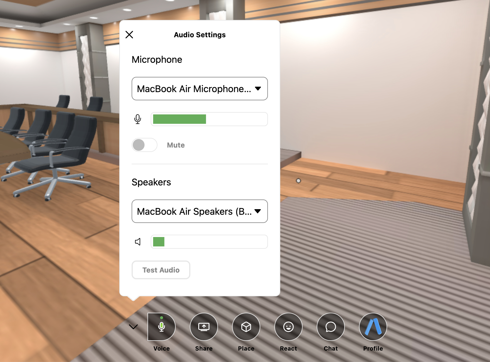
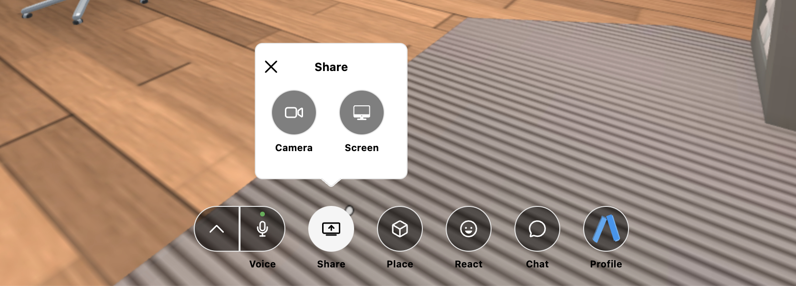
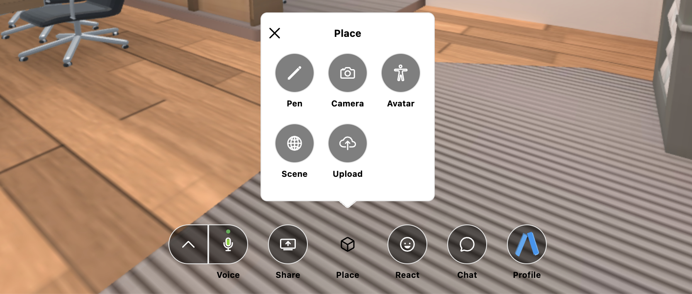
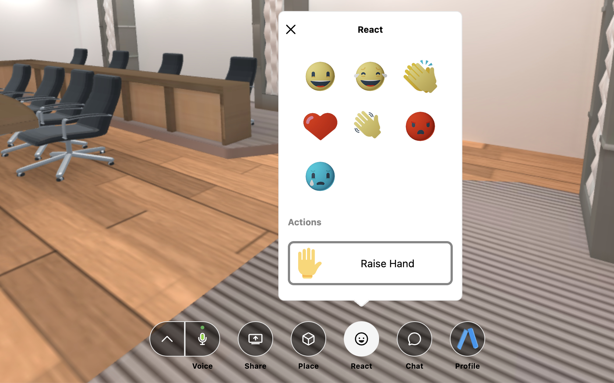

Berbagai fitur pada Aplikasi Dinus Metaverse yang dapat digunakan untuk membantu berbagai kegiatan dalam penggguaan Aplikasi Dinus Metaverse.

## 1. Voice

Mengatur nyala dan matinya microphone dan speaker, dan memilih penggunaan microphone dan speaker.

## 2. Share

### - Share Camera

Membagikan dan menampilkan camera/webcam pengguna.

### - Share Screen

Membagikan tampilan layar pengguna dengan dapat memilih tampilan layar mana yang akan dibagikan serta dapat memilih kualitas streaming.

## 3. Place

### - Drawing Pen

Menggambar di dalam ruangan virtual. Dengan klik dan tahan mouse kemudian arahkan sesuai apa yang ingin digambar. 

Untuk menghapus hasil gambar, klik "Remove All Drawing".

### - Camera

Menampilkan dan menangkap foto secara virtual avatar pengguna. 

### - Avatar

Mengganti dan memilih avatar dengan pilihan yang sudah tersedia sesuai keinginan pengguna. 

### - Upload Media

Upload media berupa gambar, video, music, object 3D dengan mencantumkan url atau memilih dari dokumen dari komputer.

## 4. React

Membagikan ekspresi/emoticon pengguna dan dapat melakukan raise hand.

## 5. Chat

Melakukan chatting/mengobrol, berbagi emoticon, dan berbagi file dengan pengguna lain di kolom chat. 

## 6. Lain-lain

### - Progressive Web App

Anda dapat menginstall aplikasi ini di desktop / smartphone anda.
