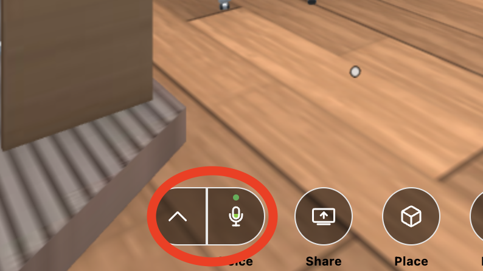
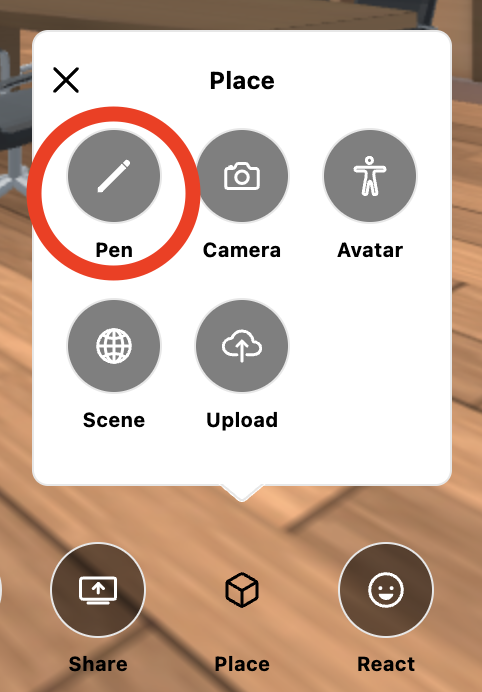
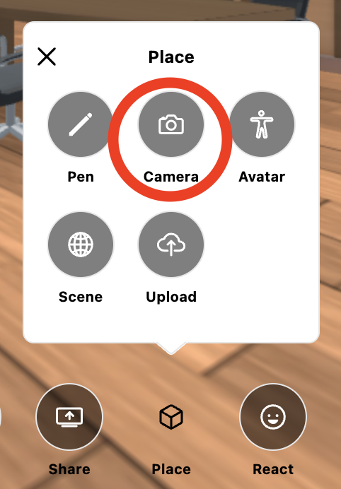
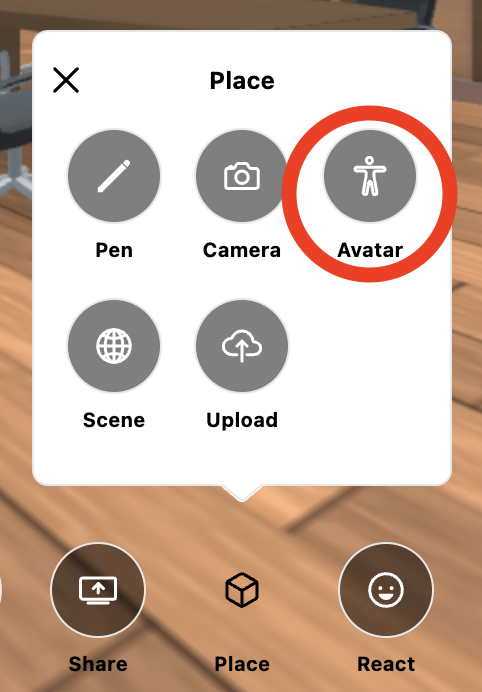
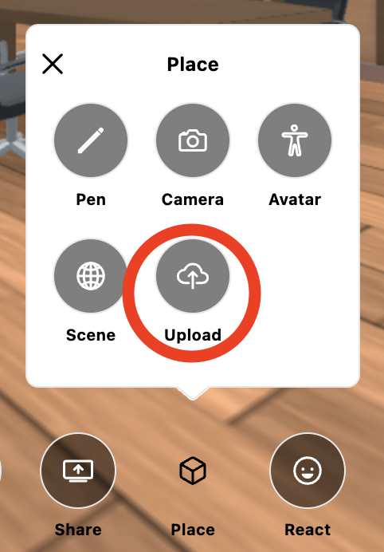
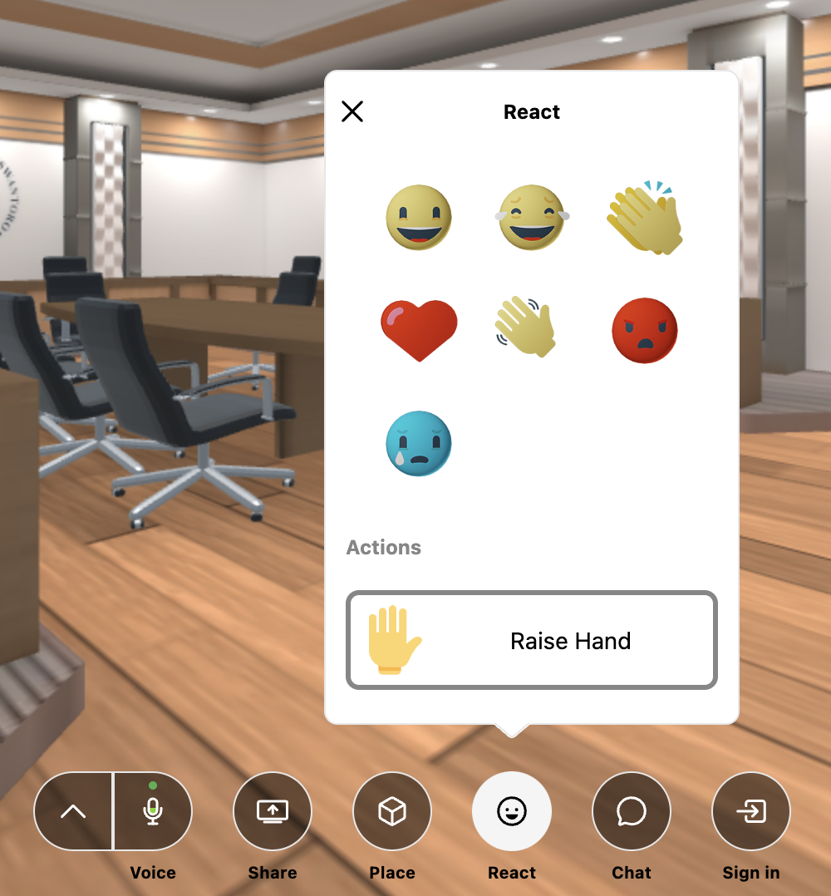
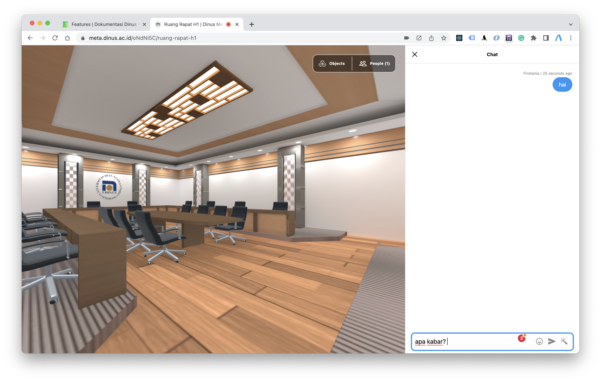

Berbagai fitur pada Aplikasi Dinus Metaverse yang dapat digunakan untuk membantu berbagai kegiatan dalam penggguaan Aplikasi Dinus Metaverse.

### Voice

Mengatur nyala dan matinya microphone dan speaker, dan memilih penggunaan microphone dan speaker.

### Share Camera

Membagikan dan menampilkan camera/webcam pengguna.

### Share Screen

Membagikan tampilan layar pengguna dengan dapat memilih tampilan layar mana yang akan dibagikan serta dapat memilih kualitas gambar/video.

### Drawing Pen

Menggambar di dalam ruangan virtual. Dengan klik dan tahan mouse kemudian arahkan sesuai apa yang ingin digambar. 

Untuk menghapus hasil gambar, klik "Remove All Drawing".

### Camera

Menampilkan dan menangkap foto secara virtual avatar pengguna. 

### Avatar

Mengganti dan memilih avatar dengan pilihan yang sudah tersedia sesuai keinginan pengguna. 

### Upload Media

Upload media berupa gambar, video, music, object 3D dengan mencantumkan url atau memilih dari dokumen dari komputer.

### React

Membagikan ekspresi/emoticon pengguna dan dapat melakukan raise hand.

### Chat

Melakukan chatting/mengobrol, berbagi emoticon, dan berbagi file dengan pengguna lain di kolom chat. 

### Multi User

Bertemu bersama sama di ruangan virtual.

### Progressive Web App

Anda dapat menginstall aplikasi ini di desktop / smartphone anda.
