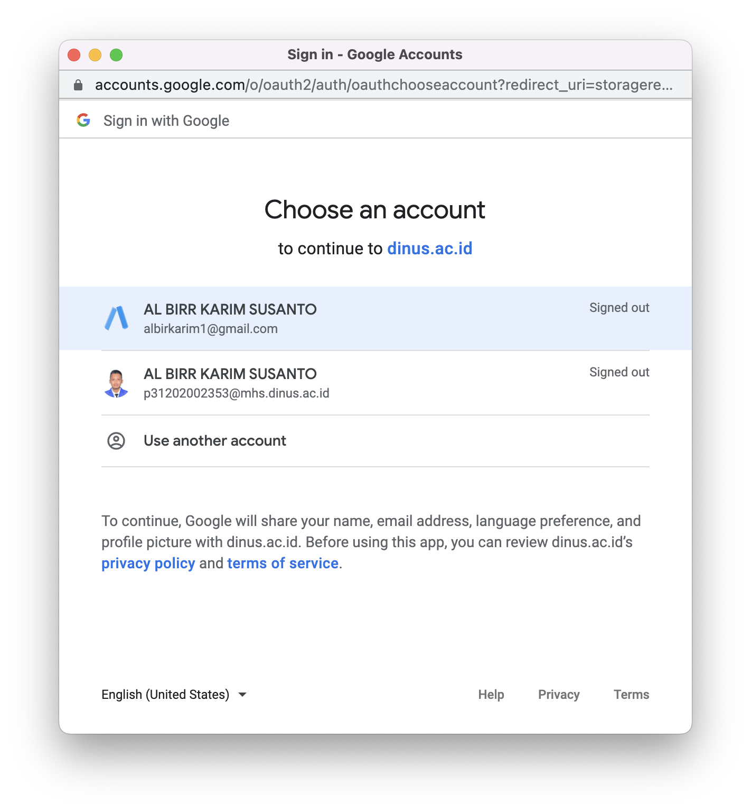
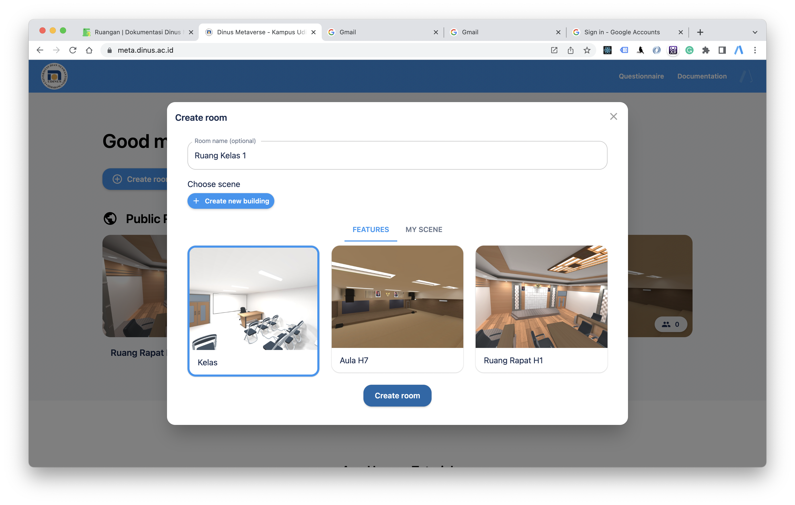
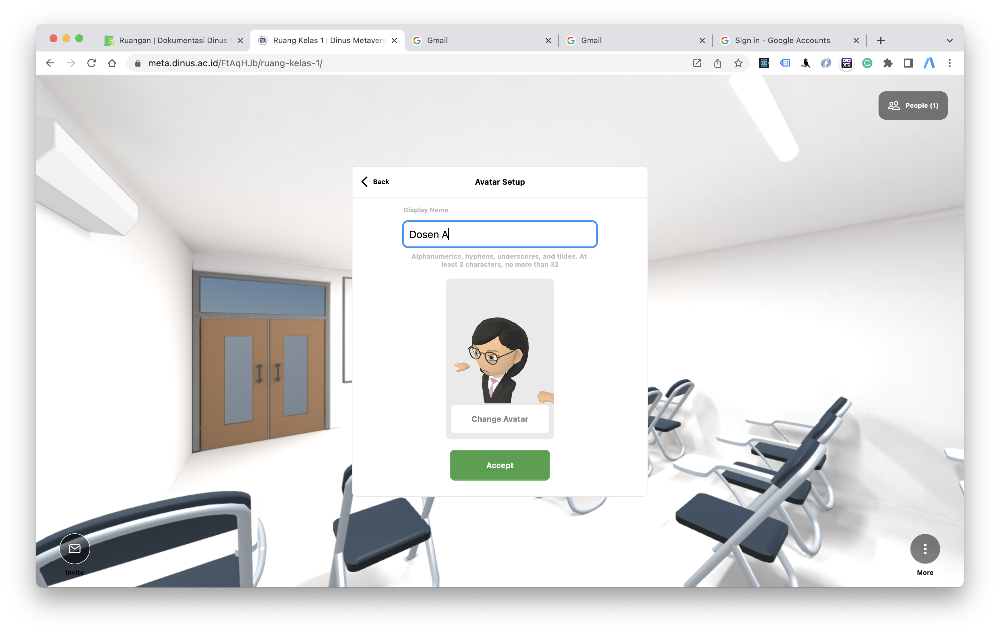
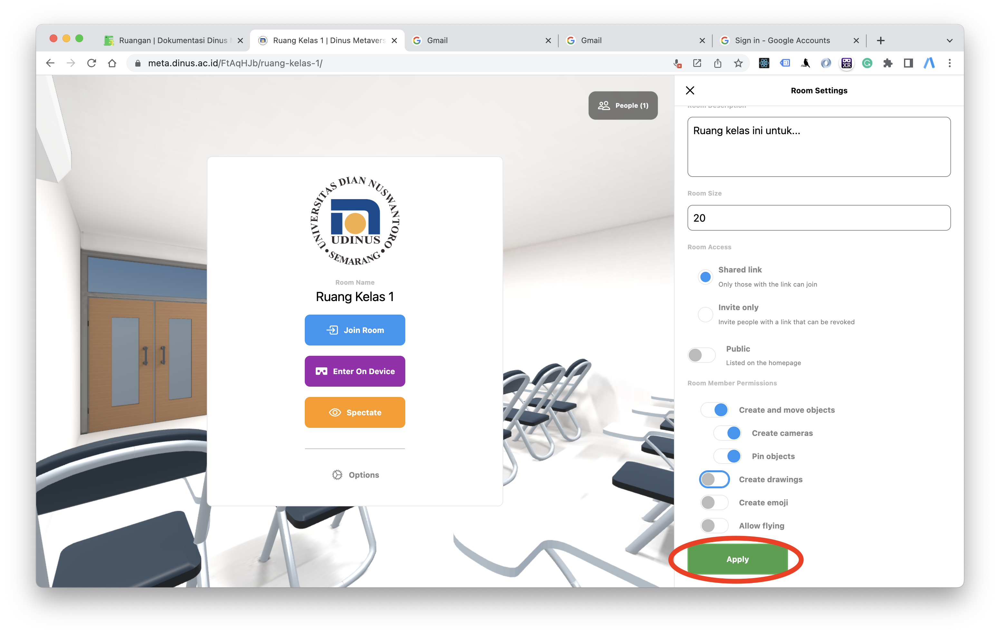
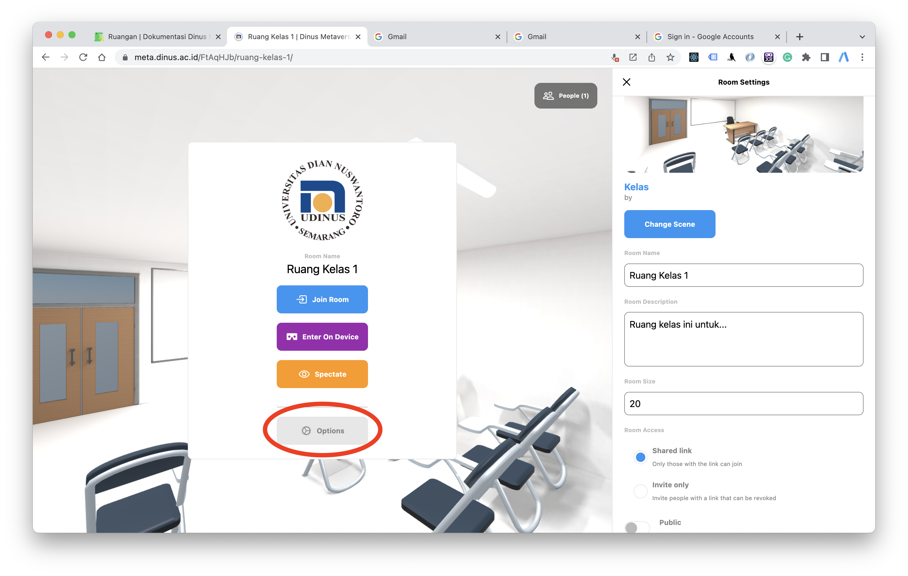
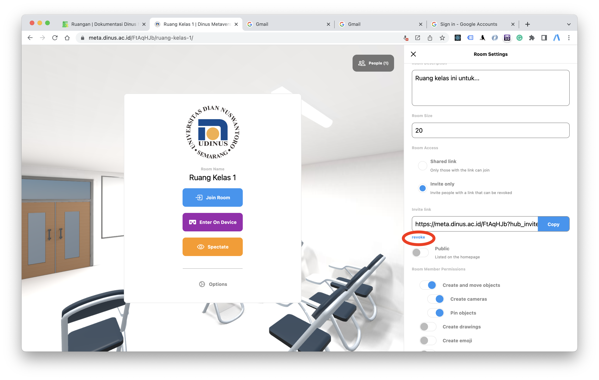

Ruang pada Aplikasi Dinus Metaverse yang dapat diatur sesuai dengan kebutuhan dan keinginan dengan bentuk yang berbeda-beda.

## Membuat ruangan

- Klik _Create Room_ pada halaman depan Dinus Metaverse, kemudian akan diarahkan untuk sign in

- Selanjutnya login menggunakan akun google (gmail) atau bisa juga untuk mahasiswa bisa menggunakan email mhs.dinus.ac.id untuk dosen bisa menggunakan email dsn.dinus.ac.id

- Selanjutnya beri nama ruangan (opsional) dan pilih bentuk bangunan yang akan digunakan sesuai keinginan dan klik tombol _Create room_

- Setelah maasuk klik tombol _Join Room_ lalu akan diminta untuk mengatur nama dan memilih avatar, lalu klik _Accept_

### Perijinan

- Pembuat ruangan juga bisa mengatur ijin akses untuk pengguna lain dalam melakukan _pemindahan objek_, _membuat objek/camera_, _pin objek_, _menggambar_, _membuat emoticon_, dan _terbang_, kemudian jika semua sudah diatur klik _Apply_

## Mengatur Ruangan

### Deskripsi, kapasitas, dan bentuk bangunan

- Pembuat ruangan dapat memilih bentuk ruangan, deskripsi bangunan, kapasitas orang yang dapat bergabung di dalam ruangan, dan juga akses ruangan.

### Membatasi siapa yang dapat memasuki ruangan

- Pembuat ruangan juga bisa mengatur range waktu dalam share link ruangan sesuai jam mulai rapat/kelas/event yang sudah ditentukan. Apabila peserta terlambat/tidak sesuai dengan waktu yang ditentukan dalam mengakses link ruangan, link dapat dihilangkan sehingga tidak bisa diakses.

Dengan klik _Room info and setting_ > _Edit_ > Invite link klik _Revoke_ > Apply

## Bergabung Ruangan

Untuk bergabung ke ruangan, pengguna bisa menggunakan link yang sudah dibagikan oleh pembuat ruangan
